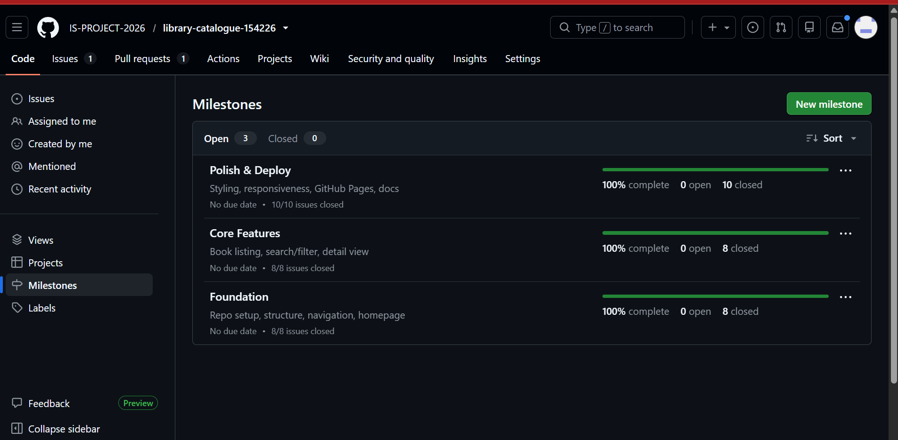
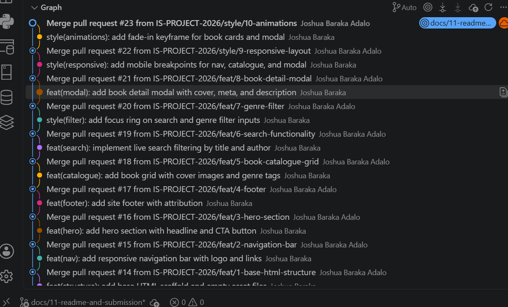
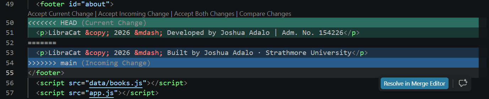
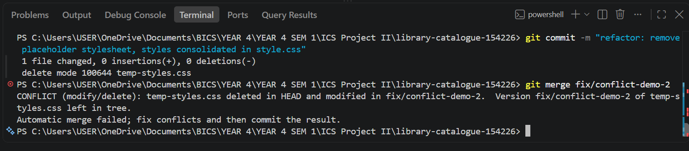
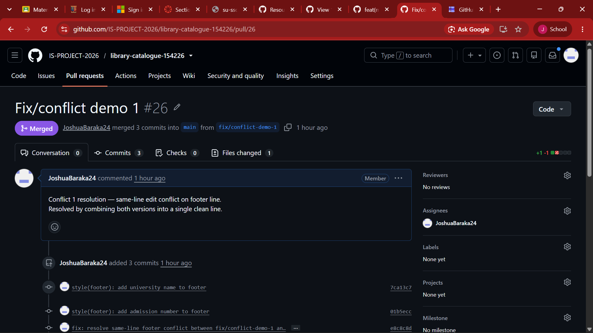
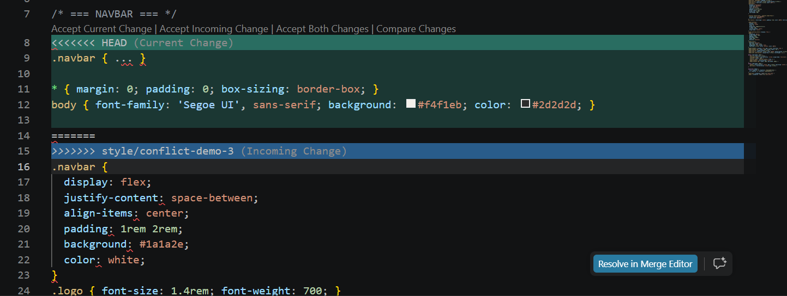

# Project Submission Report

## 1. Student Details

- **Full Name:** Joshua Adalo
- **GitHub Username:** JoshuaBaraka24
- **Email:** joshua.adalo@strathmore.edu

---

## 2. Deployed Project Link

- **Live GitHub Pages URL:** (https://is-project-2026.github.io/library-catalogue-154226/)
  *(Example: https://is-project-2026.github.io/hospital-management-138141/)*

---

## 3. Reflection — Grounded in Your Git History

> **Rules:** Every answer below **must include a direct link** to the specific commit, PR, issue, or branch in your repository that demonstrates what you are describing. Answers without working links will not be graded. Generic explanations that could apply to any project will receive zero marks.
>
> **Marks:** A (2 marks) · B (1 mark) · C (1 mark) · D (1 mark) = **5 marks total**

### A. Your Best Commit

Paste the URL of the commit in your history that you think best demonstrates clean conventional commit practice (good type tag, clear subject, meaningful body or footer).

- **Commit URL:** (https://github.com/IS-PROJECT-2026/library-catalogue-154226/commit/2952bec2b3e823e4442d8781d18b058ffff9b89d)
- **Why this one?** This commit uses the correct conventional commit format with type, scope, and subject. The body explains what the modal does and how it behaves, making the change fully traceable to Issue #8.

### B. A Mistake or Struggle

Link to a commit, PR, or issue where something went wrong — a bad commit message you had to fix, a branch you had to delete and recreate, a PR that needed rework, or a deployment that broke. 

- **Link to the evidence:** (https://github.com/IS-PROJECT-2026/library-catalogue-154226/tree/chore/12-github-pages-deployment)
- **What happened and how did you recover?** I ran `git commit` on a clean working tree with no staged changes, so the commit message containing `Closes #12` was never created. The branch had no commits ahead of main, meaning no PR could be meaningfully opened. I recovered by checking out the branch, making a real change to README.md, staging it, and committing again before pushing and opening the PR.

### C. A Pull Request You're Proud Of

Paste the URL of the PR that best shows your self-review process — one where the description is clear, the issue linkage is correct, and the diff tells a coherent story.

- **PR URL:** (https://github.com/IS-PROJECT-2026/library-catalogue-154226/pull/8)
- **What did you check before merging?** I verified the diff showed only modal-related changes in app.js and style.css, confirmed the description referenced Closes #8, and checked that clicking outside the modal closed it correctly before merging.

### D. One Thing You Would Do Differently

If you had to restart this project from scratch with everything you know now, name one specific workflow decision you would change (not a code change — a Git/project management decision).

- **What would you change?** I would ensure every branch has at least one meaningful file change before running git commit, rather than committing on a clean working tree. This wasted time on Issue 12 and required recovering the branch with an extra commit.
- **Link to the evidence of the original decision:** (https://github.com/IS-PROJECT-2026/library-catalogue-154226/tree/chore/12-github-pages-deployment)

---

## 4. Screenshots of Key GitHub Features

Demonstrate your workflow mechanics by embedding your screenshots below.

> **CRITICAL FOR WORKING IMAGES:** Do not type manual folder paths. Edit this file directly on the GitHub web interface, click on the blank line below each prompt, and **paste (Ctrl+V / Cmd+V)** your screenshot. GitHub will automatically upload the file and generate a permanent, working image link for you.

### A. Milestones and Issues
*Provide a screenshot showing your active milestone(s) and the granular tracking issues linked directly to them.*

* **Caption:** Three milestones (Foundation, Core Features, Polish & Deploy) with granular issues linked to each, showing progress tracking across development phases.

### B. Project Board
*Provide a screenshot of your GitHub Project Board with your issues organized dynamically across columns (To Do, In Progress, Done).*

.png>)

* **Caption:** Kanban board showing all 13 issues progressing through To Do, In Progress, and Done columns throughout development.

### C. Branching Architecture
*Provide a screenshot showing your local or remote Git branch list, highlighting your use of conventional, issue-linked naming patterns (e.g., `feat/`, `fix/`, `style/`).*

* **Caption:** Branch list showing conventional issue-linked naming patterns including feat/, fix/, style/, docs/, and chore/ prefixes across all 13 branches.

### D. Pull Requests & Traceability
*Provide a screenshot of a completed or open Pull Request (PR) on GitHub that clearly shows it is linked to a related development issue.*

.png>)

* **Caption:** Pull request for feat/8-book-detail-modal showing Closes #8 in the description, linking the PR directly to its tracking issue.

---

## 5. Merge Conflict Evidence

You must engineer **three merge conflicts**, each triggered by a **different cause** from those covered in the lecture. For Conflict 1, document the full resolution lifecycle. For Conflicts 2 and 3, provide the conflict marker screenshot and identify the cause.

> **Marks:** Conflict 1 full chronology (2 marks) · Conflict 2 (1 mark) · Conflict 3 (1 mark) · All three use distinct causes (1 mark) = **5 marks total**

---

### Conflict 1 — Full Chronology

**What cause did you use?** Same-line edit on diverged branches — two branches independently modified the same line in `index.html`, causing Git to be unable to determine which version to keep.

#### Step 1: Generating the Clash
*Screenshot showing the merge attempt and the conflict warning.*

* **Caption:** Branches fix/conflict-demo-1 and main both modified the same footer line in index.html, triggering an automatic merge failure.

#### Step 2: Inside the Code Editor (Conflict Markers)
*Screenshot showing the raw, unresolved conflict markers (`<<<<<<< HEAD`, `=======`, `>>>>>>>`) in your editor.*

* **Caption:** Both branches modified the footer paragraph — one added the admission number, the other added the university name. The final version combined both into a single clean line.

#### Step 3: Resolution & Clean Merge
*Screenshot of your clean Git history or completed PR showing the conflict was resolved and merged.*

* **Caption:** The conflict was resolved by combining both footer versions into one line. The fix/conflict-demo-1 branch was merged into main via pull request after clean resolution.

---

### Conflict 2 — Different Cause

**What cause did you use?** Modify/delete conflict

**Why does this cause trigger a conflict?** One branch edited `temp-styles.css` while `main` deleted it entirely. Git cannot auto-resolve this because the two histories disagree on whether the file should exist at all.

* **Caption:** main deleted temp-styles.css while fix/conflict-demo-2 modified it, creating a modify/delete conflict that Git could not auto-resolve.

---

### Conflict 3 — Different Cause

**What cause did you use?** Structural reorganization conflict

**Why does this cause trigger a conflict?** One branch restructured `style.css` by adding section comment headers and reorganizing blocks, while `main` independently edited a specific property in its original line position. Git's 3-way merge could not reconcile the differing file structures.

* **Caption:** main changed the body background color while style/conflict-demo-3 restructured the stylesheet with section headers, causing Git's 3-way merge to fail on the body rule.

---
##
## 6. Feedback & Evaluation

To help improve this course for future engineering cohorts, please take 2 minutes to fill out the anonymous feedback form. Your honest review helps shape how this program is taught next semester!
- [ ] **Anonymous Evaluation Form:** [Course & Instructor Evaluation](https://forms.gle/YLybnsyXXErKEg3s9)

---
 
## Final Submission
 
Once your repository is complete, submit your work through the official submission form below. The form will **stop accepting responses after Monday, August 17th, 2026** — no late submissions will be accepted.
 
> **Submission Form:** [https://forms.gle/KrT4VxtFtkU3wtYu8](https://forms.gle/KrT4VxtFtkU3wtYu8)
